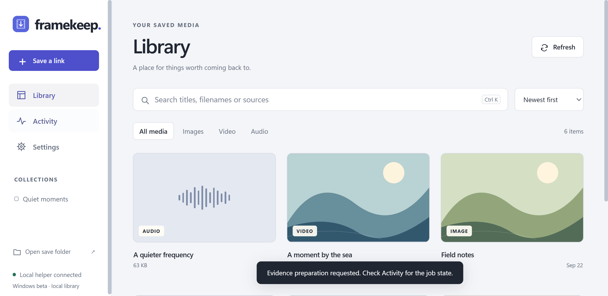
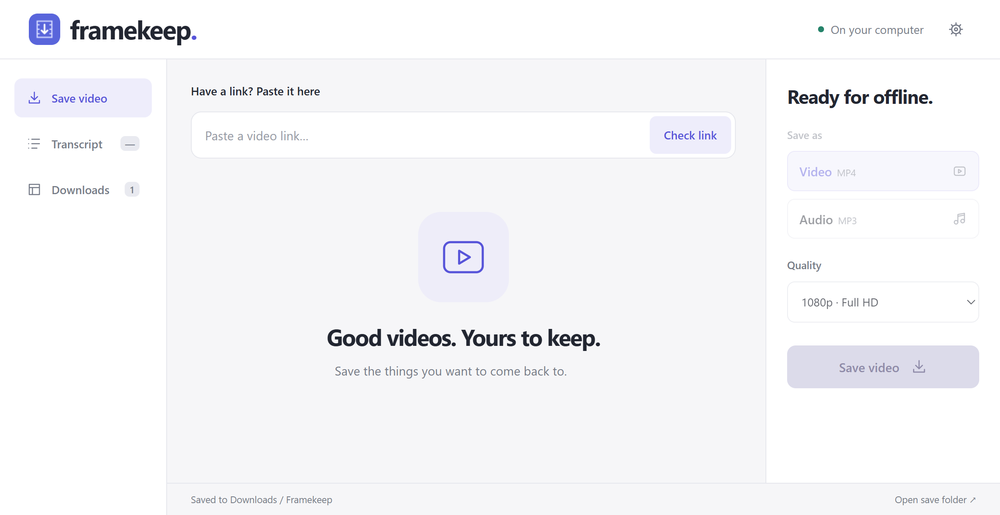
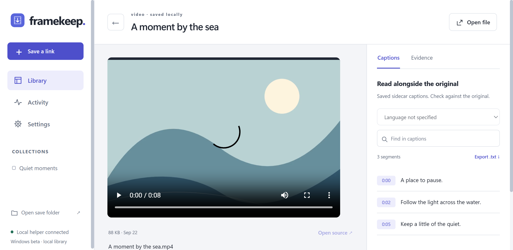
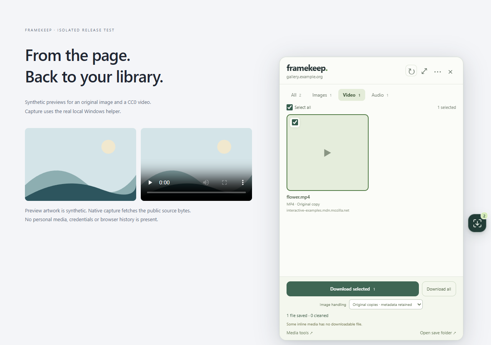

# Framekeep

**Keep useful media close.** Capture from Chrome, find it in your Windows library, and return to the source, playback and available captions in one workspace.

Windows / Chrome · 1.8.0-beta.1 · local storage · MIT original source



Framekeep combines a draggable Chrome media picker with a Windows Desktop app. The extension focuses on fast capture; Desktop provides a searchable library, media workspace and shared activity. The existing capture/extraction engine is retained.

- Discover page images, direct video/audio and supported players. Preview, select and save a batch.
- Save supported public video as MP4 or audio as MP3, with independent progress and cancellation.
- Search the local Library, filter media, organize collections, play saved files and reopen sources.
- Read available captions, search phrases, seek to timestamps and export transcripts.
- Inspect the same durable job IDs from Desktop and the included CLI/MCP entry points.
- Inspect optional prepared study evidence with source references and limitations. Preparation does not establish human review.

Basic capture and playback require no account, paid inference or local model. Visible media is not a guarantee that its server permits download. Save only material you are authorized to handle.

## Install on Windows

1. Install **64-bit Python 3.11+**, **Node.js 22+**, **FFmpeg** (including FFprobe), and **Microsoft WebView2 Evergreen Runtime** at user or machine scope. Put Python, Node and FFmpeg on PATH.
2. Download and extract the Windows ZIP from this repository's **Releases** page. Keep it in a stable local directory.
3. Double-click **Install Framekeep.cmd** in File Explorer. It installs the small app/helper under `%USERPROFILE%\Applications\Framekeep`, reuses your runtimes and installs missing Python packages at user scope.
4. Open `chrome://extensions`, enable **Developer mode**, choose **Load unpacked**, and select the extracted `extension` directory. Pin Framekeep.
5. On a page, open the floating picker, select media and save. Images default to **Original copies · metadata retained**. Choose cleaning only when the optional local sanitizer is installed. Open Framekeep from Start to find the result.

The stable extension ID is `mddibmfbdbahbimeclofpakiekckanio`. Its manifest public key is an identifier, not a signing secret. This is an unpacked extension beta, not a Chrome Web Store release. The launcher is locally compiled and unsigned. There is no automatic updater or paid signing service. Do not disable security controls to install it.

See [installation, update and uninstall](docs/installation.md), [architecture and agent interfaces](docs/architecture.md), and [limits and validation](docs/limitations.md).

## The beta interface

Desktop now opens to a media Library, with Activity and Settings one step away. The item workspace keeps playback and source captions together. The screenshots below were captured from the actual Windows WebView2 application using authored fixtures.

| Earlier Desktop | Beta Library |
| --- | --- |
|  |  |



## Daily use

The floating picker offers Images, Video and Audio filters, previews and multiple selection. Original-copy mode retains metadata. Cleaning requires the optional compatible local sanitizer; a failed cleaning request never silently becomes an unclean saved result. Streaming/player cards open the existing format and quality controls.

Finished files appear in **Library**. Open an item for playback and captions, use **Open file** for the system-associated application, or return to its source. **Activity** shows actual jobs and errors. Cancellation is offered where supported; downloads do not claim pause/resume. Reopening saved results never downloads them again.



## Build and test

Plain JavaScript and Python; no frontend bundle or npm dependency installation is needed for these checks.

```powershell
git clone https://github.com/quenmatkhau1234s/framekeep.git
cd framekeep
npm test
npm run check
python -B -m unittest discover -s tests -p "*_test.py"
powershell -NoProfile -ExecutionPolicy Bypass -File scripts/Build-Launcher.ps1 -Destination "$env:TEMP\Framekeep-build" -Python (Get-Command python.exe).Source
npm run package
```

Packaging creates source, Windows installer and extension ZIPs with checksums. The Windows archive includes source and scripts; installation compiles the small launcher using the Windows .NET Framework compiler. Runtimes, caches, personal libraries, optional study tools and private workspace history are excluded.

The CLI and stdio MCP adapter use the same configured library and operations. Optional Study Suite preparation requires a separately installed compatible tool; it is not automatically downloaded or bundled into this release.

## Privacy and contributing

Media and local metadata stay on your computer. No telemetry, cloud sync, browser-cookie extraction, password access or paid inference service. Media requests go to the selected source servers. Source links can contain private parameters; do not publish local library metadata or diagnostic reports without reviewing them.

Read [CONTRIBUTING.md](CONTRIBUTING.md), [SECURITY.md](SECURITY.md), [LICENSE](LICENSE), [third-party notices](THIRD_PARTY_NOTICES.md) and the [changelog](CHANGELOG.md). MIT applies to original Framekeep code, not separately installed tools or captured media.
